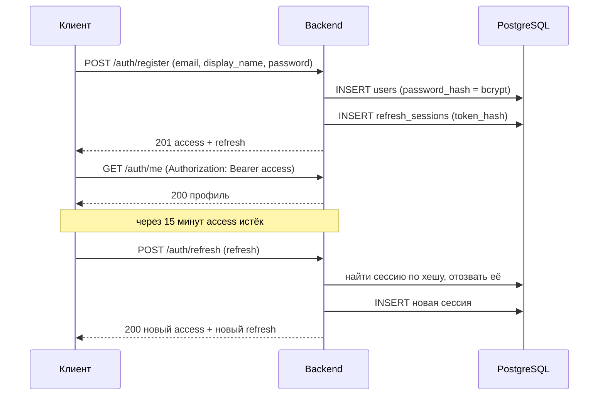

# Аутентификация

Вход выполняется по email и паролю. Дальше клиент работает с парой токенов: коротким access-токеном (JWT) и долгим refresh-токеном.

## Почему две разные технологии

| | Access-токен | Refresh-токен |
| --- | --- | --- |
| Формат | JWT, подпись HS256 | 32 случайных байта, base64url |
| Время жизни | 15 минут | 30 дней |
| Где проверяется | по подписи, без обращения к БД | по хешу строки в `refresh_sessions` |
| Что хранит сервер | ничего | только SHA-256 хеш токена |

Access-токен проверяется подписью, поэтому каждый запрос к API обходится без запроса в базу — это и есть смысл JWT. Плата за это в том, что выданный токен нельзя отозвать досрочно: он остаётся валидным до истечения `exp`. Именно поэтому его время жизни короткое.

Refresh-токен, наоборот, отзывается мгновенно, потому что живёт строкой в базе. Он не JWT: подписывать нечего, весь смысл — в непредсказуемости 256 бит и в возможности отозвать сессию.

## Пользовательский путь



Регистрация сразу выдаёт токены: клиенту не нужно делать второй запрос на вход.

## Ротация refresh-токенов и реакция на утечку

Каждый успешный `/auth/refresh` отзывает предъявленный токен и выдаёт новый. Поэтому один refresh-токен используется ровно один раз.

Если предъявлен уже отозванный токен, значит его кто-то сохранил и воспроизводит: либо украли у клиента, либо утекло хранилище. Сервер не может отличить настоящего владельца от атакующего, поэтому отзывает **все** сессии пользователя. Владелец логинится заново, атакующий остаётся ни с чем.

## Защита от подбора и перечисления

- **Хеширование пароля.** bcrypt с cost 12. Соль генерируется на каждый хеш, поэтому два одинаковых пароля дают разные хеши, а радужные таблицы бесполезны.
- **Одинаковый ответ на неизвестный email и на неверный пароль.** Оба случая дают `401 invalid_credentials` с идентичным телом. Если пользователь не найден, сервер всё равно выполняет сравнение bcrypt с фиктивным хешем — иначе неизвестный email отвечал бы заметно быстрее, и по времени ответа можно было бы собрать базу зарегистрированных адресов.
- **Ограничение частоты.** `/auth/register`, `/auth/login` и `/auth/refresh` ограничены 10 запросами в минуту с одного IP. Лимит хранится в памяти процесса, поэтому при нескольких репликах бюджет умножается на их число; для MVP это приемлемо, при масштабировании счётчик переносится в Redis.
- **Заголовки пересылки игнорируются.** `X-Forwarded-For` подделывается любым клиентом, поэтому ключом лимита служит адрес соединения. Когда сервис встанет за известный прокси, заголовку можно будет доверять.
- **Строгая проверка JWT.** Алгоритм зафиксирован в парсере (`HS256`), а `iss` и `aud` проверяются на каждом запросе. Это закрывает подстановку токена с `alg: none` и токена, выпущенного для другого сервиса тем же ключом.
- **Отдельный `jti` у каждого токена.** Сейчас он не используется, но делает возможным точечный отзыв одного токена, если он понадобится.

## Статус аккаунта

`users.status` проверяется не только при входе, но и при обновлении токенов и в `/auth/me`. Поэтому заблокировать пользователя достаточно в базе: доступ пропадёт максимум через время жизни access-токена, а обновить его блокированный пользователь уже не сможет.

## API

Базовый префикс — `/api/v1`. Тело запроса и ответа — JSON.

| Метод | Путь | Авторизация | Назначение |
| --- | --- | --- | --- |
| `POST` | `/auth/register` | — | Создать аккаунт и сразу войти. |
| `POST` | `/auth/login` | — | Войти по email и паролю. |
| `POST` | `/auth/refresh` | — | Обменять refresh-токен на новую пару. |
| `POST` | `/auth/logout` | — | Отозвать предъявленный refresh-токен. |
| `POST` | `/auth/logout-all` | Bearer | Отозвать все сессии пользователя. |
| `GET` | `/auth/me` | Bearer | Профиль текущего пользователя. |

### Регистрация

```http
POST /api/v1/auth/register
Content-Type: application/json

{
  "email": "player@avito.ru",
  "display_name": "Игрок",
  "password": "correct-horse-battery"
}
```

```json
{
  "access_token": "eyJhbGciOiJIUzI1NiIsInR5cCI6IkpXVCJ9...",
  "token_type": "Bearer",
  "expires_in": 900,
  "expires_at": "2026-08-04T12:15:00Z",
  "refresh_token": "u3Xk9...",
  "refresh_token_expires_at": "2026-09-03T12:00:00Z",
  "user": {
    "id": "0d3f...",
    "email": "player@avito.ru",
    "display_name": "Игрок",
    "status": "active",
    "created_at": "2026-08-04T12:00:00Z"
  }
}
```

Поля токенов названы по OAuth 2.0 (`access_token`, `token_type`, `expires_in`), поэтому подходят стандартным HTTP-клиентам без отдельного маппинга.

`/auth/login` и `/auth/refresh` возвращают то же тело со статусом `200`. `/auth/logout` и `/auth/logout-all` возвращают `204` без тела.

### Защищённые запросы

```http
GET /api/v1/auth/me
Authorization: Bearer <access_token>
```

### Ошибки

Все ошибки приходят в одном конверте:

```json
{ "error": { "code": "validation_failed", "message": "...", "field": "password" } }
```

| Код | HTTP | Когда |
| --- | --- | --- |
| `bad_request` | 400 | Тело не JSON, лишнее поле, слишком большой запрос. |
| `validation_failed` | 400 | Поле не прошло проверку; имя поля в `field`. |
| `invalid_credentials` | 401 | Неверный email или пароль. |
| `unauthorized` | 401 | Access- или refresh-токен отсутствует, истёк или недействителен. |
| `user_not_active` | 403 | Аккаунт заблокирован или удалён. |
| `email_taken` | 409 | Адрес уже зарегистрирован. |
| `rate_limited` | 429 | Превышен лимит запросов; в `Retry-After` — сколько ждать. |
| `internal_error` | 500 | Внутренняя ошибка; причина только в логах. |

Клиент ветвится по `code`, а не по `message`: тексты могут меняться.

## Правила для полей

| Поле | Ограничение | Почему |
| --- | --- | --- |
| `email` | до 254 символов, один `@`, без display-части | Совпадает с ограничением RFC 5321 и с уникальным индексом `users_email_lower_uidx`. Приводится к нижнему регистру и обрезается по краям. |
| `display_name` | 2–40 символов | Повторяет `CHECK` в схеме, поэтому неверный ввод даёт 400, а не ошибку ограничения БД. |
| `password` | 8–72 байта | Нижняя граница — минимальная стойкость, верхняя — предел bcrypt: длиннее он молча обрезал бы пароль. Ограничение в байтах, поэтому кириллический пароль упирается в лимит на 36 символах. |

## Хранение токенов на клиенте

Refresh-токен возвращается в теле ответа, а не в cookie: frontend и backend в разработке живут на разных портах, а cookie с `SameSite=None` требует HTTPS и не работает на `http://localhost`. Клиент хранит токены в памяти приложения и отправляет access-токен заголовком `Authorization`.

Когда фронтенд и API будут за одним доменом, refresh-токен стоит перевести в `HttpOnly; Secure; SameSite=Strict` cookie — это уберёт его из досягаемости JavaScript и снимет риск кражи через XSS. Формат ответа менять при этом не нужно: поле просто перестанет заполняться.

## Конфигурация

| Переменная | По умолчанию | Назначение |
| --- | --- | --- |
| `JWT_SECRET` | — (обязательна) | Ключ подписи HS256, минимум 32 символа. Сервис не стартует без него. |
| `JWT_ISSUER` | `avito-tamagotchi` | Значение `iss`; проверяется при разборе токена. |
| `ACCESS_TOKEN_TTL` | `15m` | Время жизни access-токена. |
| `REFRESH_TOKEN_TTL` | `720h` | Время жизни refresh-токена; должно быть больше `ACCESS_TOKEN_TTL`. |
| `BCRYPT_COST` | `12` | Стоимость bcrypt, допустимо 10–15. Выше — дороже подбор, но и дороже каждый вход. |

Секрет генерируется отдельно для каждого окружения:

```bash
openssl rand -base64 48
```

Смена `JWT_SECRET` делает недействительными все выданные access-токены; refresh-токены переживают её, потому что проверяются по базе, а не по подписи.

## Что осталось за рамками

- Подтверждение email и восстановление пароля.
- Смена пароля: когда появится, она должна вызывать `LogoutAll`, иначе старые сессии переживут смену.
- Удаление истёкших строк `refresh_sessions`. Строк накапливается по одной на вход, для MVP это несущественно; регламентная очистка — `DELETE FROM refresh_sessions WHERE expires_at <= NOW()`.
- Создание питомца при регистрации — задача ветки игровой механики.

## Структура кода

| Пакет | Ответственность |
| --- | --- |
| `internal/auth` | Домен: сценарии входа, выпуск и разбор JWT, хеширование паролей, правила валидации. Не знает ни про HTTP, ни про SQL. |
| `internal/auth/authtest` | Репозитории в памяти для тестов, по образцу `net/http/httptest`. |
| `internal/storage` | Реализация репозиториев на PostgreSQL. |
| `internal/httpserver` | Транспорт: маршруты, разбор запросов, middleware, отображение доменных ошибок в HTTP-коды. |

Домен объявляет интерфейсы репозиториев у себя (`auth.UserRepository`, `auth.SessionRepository`), а `internal/storage` их реализует. Зависимость направлена внутрь: заменить хранилище можно, не трогая логику входа.

## Тесты

```bash
make test              # unit-тесты, без инфраструктуры
make up                # поднять PostgreSQL с миграциями
make test-integration  # то же плюс тесты репозиториев на реальной базе
```

Тесты в `internal/storage` пропускаются, если не задан `TEST_DATABASE_URL`, поэтому `go test ./...` работает без запущенной базы.
