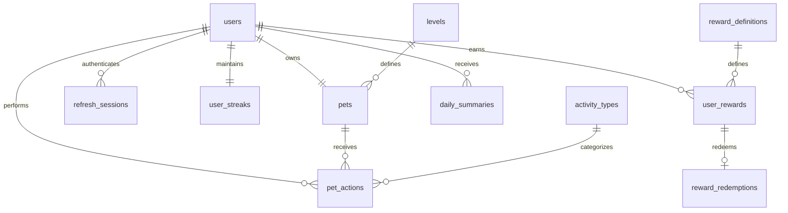

# База данных

## Выбор PostgreSQL

PostgreSQL используется как основное хранилище, потому что данные MVP связаны транзакциями: действие пользователя должно одновременно изменить состояние питомца, начислить опыт, обновить серию посещений и при необходимости выдать награду. Реляционные ограничения защищают эти связи, а `JSONB` оставляет гибкость для состояния питомца и параметров бонусов.

Для MVP отдельное хранилище лидерборда не требуется. Рейтинг рассчитывается представлением `leaderboard`; при росте нагрузки его можно заменить материализованным представлением или вынести чтение рейтинга в Redis без изменения основной модели.

## Схема



### Основные таблицы

| Таблица | Назначение |
| --- | --- |
| `users` | Учётная запись и статус пользователя. Email уникален без учёта регистра. |
| `pets` | Текущее состояние питомца, уровень, опыт и версия состояния для WebSocket-событий. |
| `levels` | Порог общего опыта для каждого уровня. |
| `activity_types` | Настраиваемые действия, опыт, дневной лимит и cooldown. |
| `pet_actions` | Неизменяемый журнал действий и начисленного опыта. |
| `user_streaks` | Текущая и максимальная серия активных дней. |
| `daily_summaries` | Итоги дня и снимки состояния питомца до и после активности. |
| `reward_definitions` | Каталог наград и условия выдачи. |
| `user_rewards` | Экземпляр награды, принадлежащий конкретному пользователю. |
| `reward_redemptions` | Однократное подтверждение использования награды во внешнем продукте. |
| `refresh_sessions` | Сессии обновления токенов; в БД хранится только хеш токена. |

## Целостность и безопасность

- Каждое действие получает `idempotency_key`; повторный запрос пользователя не начисляет опыт второй раз.
- Награда связана с `user_id`, а `reward_redemptions.user_reward_id` уникален, поэтому одну выдачу нельзя погасить повторно.
- Клиентский код награды не хранится открытым текстом: сервер сохраняет только `claim_token_hash` и сравнивает хеш при погашении.
- Изменение состояния питомца, запись действия и выдача награды должны выполняться одной транзакцией.
- Пароли и refresh-токены хранятся только в виде стойких хешей; миграции не содержат секретов.

## Миграции

Схемой управляет [goose](https://github.com/pressly/goose). Файлы находятся в `backend/migration` и именуются `<version>_<description>.sql`; каждый содержит секции `-- +goose Up` и `-- +goose Down`. Применённые версии goose хранит в таблице `goose_db_version`.

Миграции встроены в бинарь `migrate` (`go:embed`) и применяются отдельным сервисом Docker Compose на том же образе, что и backend:

```bash
docker compose run --rm migrate          # применить новые миграции (up)
docker compose run --rm migrate status   # показать статус
docker compose run --rm migrate down     # откатить последнюю миграцию
```

Повторный `up` идемпотентен: уже применённые версии пропускаются. Изменять применённую миграцию нельзя — исправления схемы оформляются новой миграцией. Секция `-- +goose Down` описывает обратную операцию; в production откат выполняется осознанно, чтобы не потерять данные.

## Начальные данные

Миграция `00002_seed_reference_data.sql` добавляет стартовые уровни и действия (`ON CONFLICT DO NOTHING`, поэтому повторное применение безопасно). Значения являются базовой гипотезой MVP: продуктовая команда может менять их следующими миграциями после проверки экономики.
